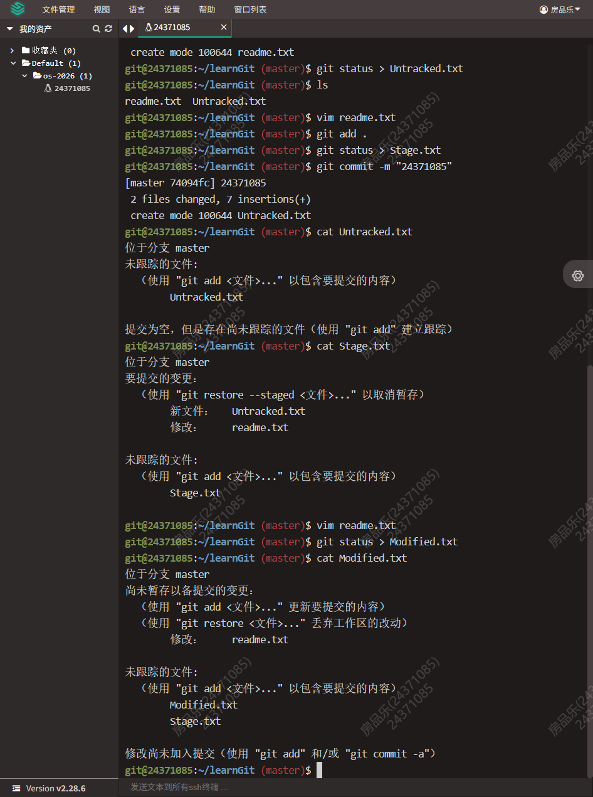
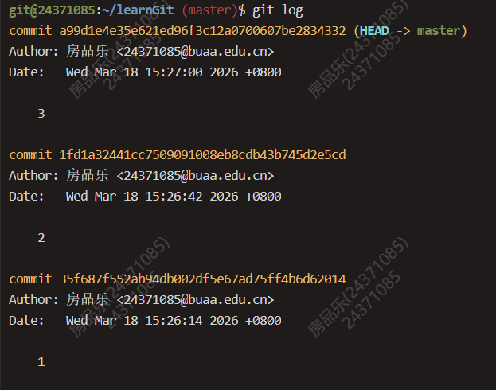
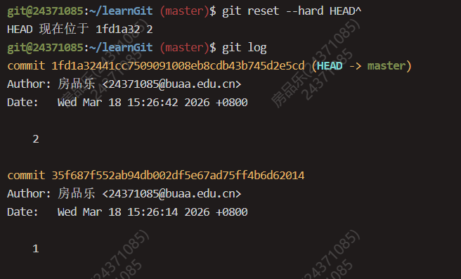
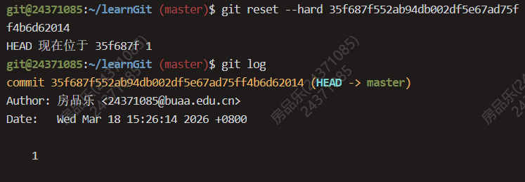
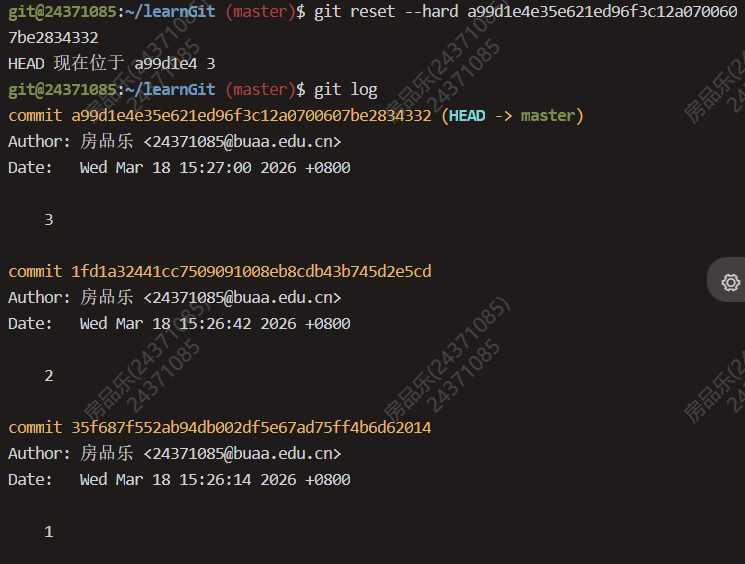
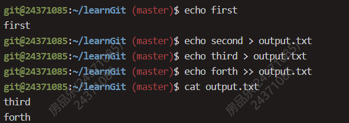

# OS-Lab0 实验报告

## 思考题

### Thinking 0.1



问题：执行命令 cat Modified.txt，观察其结果和第一次执行 add 命令之前的 status 是
否一样，并思考原因。

- 区别：
  
  - 第一次执行add前：README.txt的状态是为跟踪。Git提示这是一个全新的文件，完全不在Git的管理范围之内。
  - 现在的状态：README.txt的状态是"Changes not staged for commit"，未暂存以备提交的变更，标记为modified。

- 原因：
  
  - 执行第一次`git add`和`git commit`后，README.txt已经变成了一个**受版本控制（Tracked）**的文件。
  - 只要文件被commit过一次，就永远是Tracked状态的。之后对其任何修改，Git都能是被出来其被修改了，而不是一个新发现的陌生文件。

### Thinking 0.2

问题：仔细看看0.10，思考一下箭头中的 add the file 、stage the file 和
commit 分别对应的是 Git 里的哪些命令呢？

- add the file(Untracked->Staged):`git add`
- stage the file(Modified->Staged):`git add`
- commit(Staged->Unmodified):`git commit`

### Thinking 0.3

- 代码文件 print.c 被错误删除时（手动删除，未执行 git 命令），应当使用什么命令将其恢复？
  
  - `git restore print.c` 
  - print.c仍然在暂存区，只是在工作区被删除，只需将工作区恢复到暂存区状态即可。

- 代码文件 print.c 被错误删除后，执行了 `git rm print.c` 命令，此时应当使用什么命令将其恢复？
  
  - `git reset HEAD print.c` + `git restore print.c`
  - 因为执行了`git rm print.c`，暂存区已被改动，所以需要先恢复暂存区的内容。

- 无关文件 hello.txt 已经被添加到暂存区时，如何在不删除此文件的前提下将其移出暂存区？
  
  - `git rm -cached hello.txt`

### Thinking 0.4

第一次`git log`：


版本回退一次后`git log`：


版本切换到1后`git log`：


版本切换到3后`git log`：


### Thinking 0.5



只需注意覆盖与追加的区别

### Thinking 0.6

command:

```bash
echo 'echo Shell Start...' > test
echo 'echo set a = 1' >> test
echo 'a=1' >> test
echo 'echo set b = 2' >> test
echo 'b=2' >> test
echo 'echo set c = a+b' >> test
echo 'c=$[$a+$b]' >> test
echo 'echo c = $c' >> test
echo 'echo save c to ./file1' >> test
echo 'echo $c>file1' >> test
echo 'echo save b to ./file2' >> test
echo 'echo $b>file2' >> test
echo 'echo save a to ./file3' >> test
echo 'echo $a>file3' >> test
echo 'echo save file1 file2 file3 to file4' >> test
echo 'cat file1>file4' >> test
echo 'cat file2>>file4' >> test
echo 'cat file3>>file4' >> test
echo 'echo save file4 to ./result' >> test
echo 'cat file4>>result' >> test
```

result

```text
Shell Start...
set a = 1
set b = 2
set c = a+b
c = 3
save c to ./file1
save b to ./file2
save a to ./file3
save file1 file2 file3 to file4
save file4 to ./result
e
2
1
```

- echo echo Shell Start 与 echo `echo Shell Start` 效果是否有区别
  
  - 前者将Shell视为纯字符串处理，会直接打印echo Shell Start
  - 后者使用反引号表示命令替换，会先执行`echo Shell Start`，然后外层`echo`打印结果Shell Start. 

- echo echo $c>file1 与 echo `echo $c>file1` 效果是否有区别

  - 前者将整个命令输出重定向到file1，在终端没有任何标准输出
  - 后者先执行`echo $c>file1`把字符串`$c`写入file2，在终端没有任何标准输出，外层`echo`接收到一个空的结果，于是只打印一个换行符。

## 难点分析

- Git工具上手简单，但实现高效且安全的版本管理比较复杂，需要对Git工具有深刻理解。
- sed awk grep指令的使用方法较为复杂，有多种灵活的运用。
- 命令行工具符号使用有诸多细节，如双引号会转义符号，因此需要转义符辅助。

## 实验体会

- exam十分简单，只是需要注意`.PHONY`的使用。
- extra最后一问较为综合，cut,sed,sort,uniq以及管道的使用有些复杂，很多细节需要用man进行查询，下次可以提前下好tldr插件，查询更方便。
- 不停vim再退出调试还是太复杂了，下次可以尝试更好的GDB调试方法。
