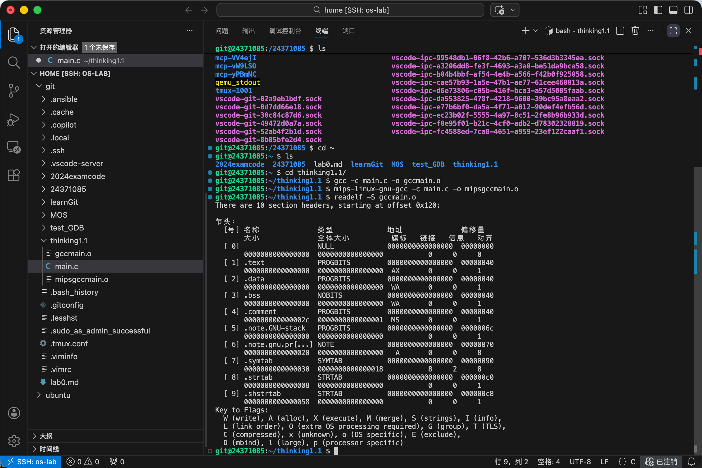
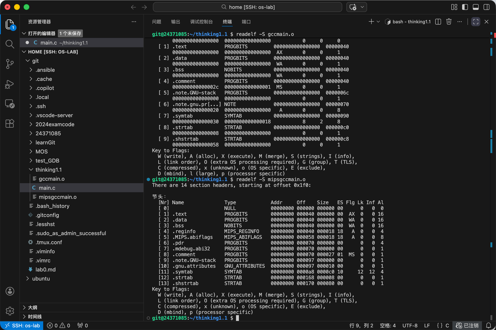
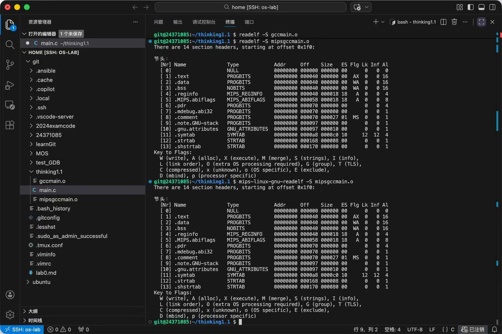
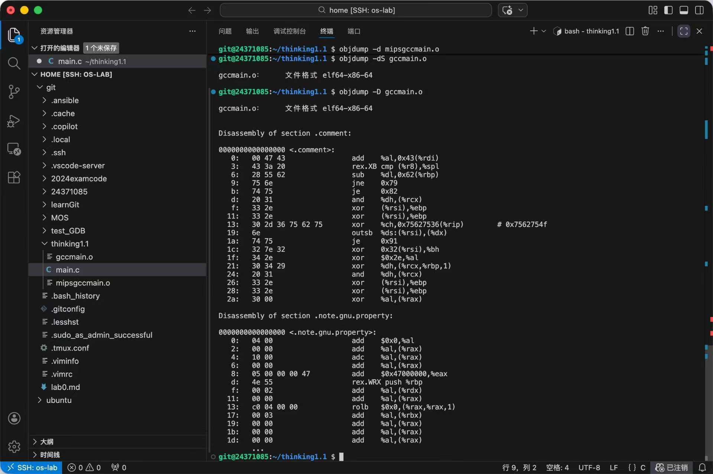
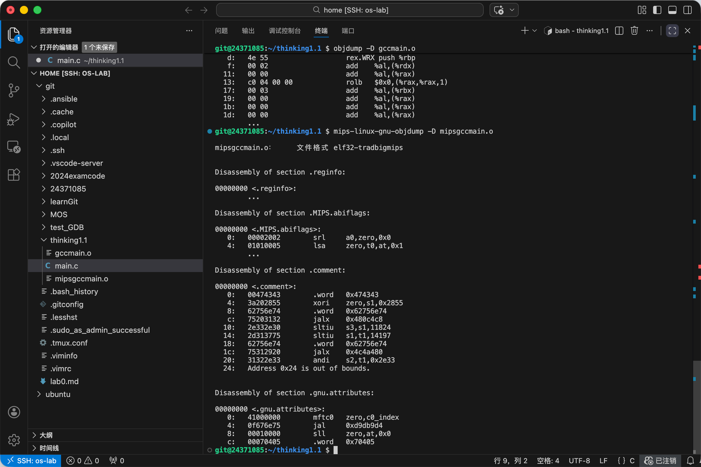
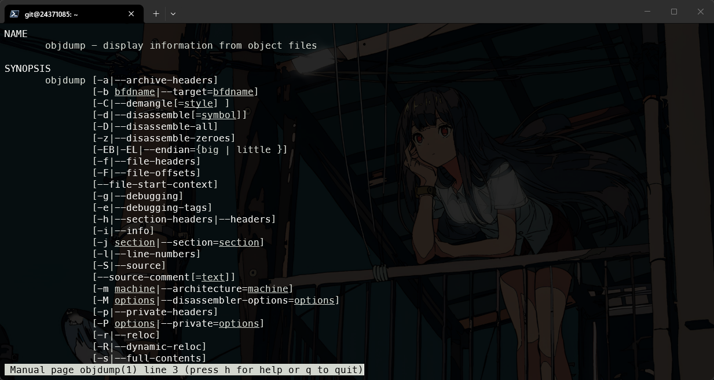
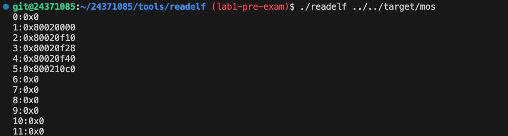
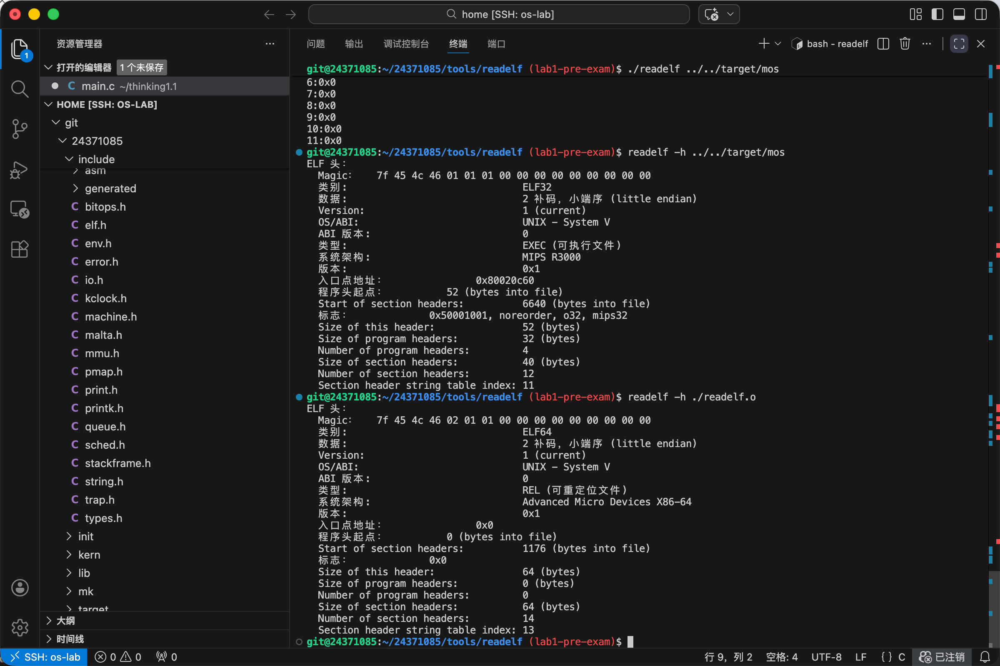

# OS-Lab1 实验报告

## 思考题

### Thinking1.1

#### gcc编译readelf

原生x86

MIPS交叉编译工具链

readelf在不使用mips交叉编译工具链的时候也可以正确阅读由mips交叉编译工具链编译得到的内容。

#### objdump

用原生x86的objdump反编译gccmain.o结果如下：

用MIPS交叉编译工具链的objdump反编译mipsgccmain.o结果如下：

#### objdump的参数含义

`man objdump`

其中比较常用的如下：

-e：显示调试信息
-D：反汇编所有section
-r：显示文件的重定位入口
-S：尽可能反汇编出源代码
-z：将0也进行反汇编

### Thinking1.2

#### 用readelf解析mos

#### 用readelf解析文件本身

无输出结果。

可以用`readelf -h`来研究文件头

用readelf分析mos与readelf.o

其类别分别为ELF32和ELF64。~~~~

在readelf.c中，我们采用的都是ELF32类型的数据结构，因此不能用来解析ELF64文件。

### Thinking1.3

- 为什么操作系统的内核入口并没有放在上电启动地址，还能保证内核入口被正确跳转到？
  
  - 上电启动位置是用于启动bootloader，实现硬件初始化等内容。而bootloader所加载的内容才决定了内核的入孔，也就是start.S中写的_start函数才是mips_init的入口。

## 难点分析

### readelf文件的实现

.elf包含.exe,.o和.so，即**可执行文件**，**可重定位文件**和**共享对象文件**。可以用readelf解析hello，readelf，readelf.o，main.o等多种文件。

在elf.h中，对ELF32的种种内容做出了定义。即`Elf32_Ehdr``Elf32_Shdr``Elf32_phdr`三种类型，分别描述ELF头，节头表和段头表。

实现的readelf是只能解析ELF32的section地址的可执行程序。使用shdr指针定位各个section，从而输出地址。让sh_table指针指向节头表第一项的地址：`binary + ehdr->e_shoff`，接下来循环输出即可。

注意需将sh_table这一指针变为Elf_Shdr*类型。

### printk函数的实现

vprintfmt的参数：out函数指针，data指针，fmt字符串，ap数组。

out函数指针能实现在同一函数中调用不同形式的out函数，可以实现输出以buf为起点，长度为len的字符串。

我们需要补充的核心逻辑就是将`%x`替换为对应的数据。即找到%并解析%后面的内容。每当找到%时就讲前面内容全部out输出，找到%时通过对其后内容解析来改变参数即可。

## 实验体会

Lab1不同于Lab0的前置知识，一下需要阅读大量的代码，初期的实验推进十分困难。指导书的阅读也频频受阻。（为了降低不必要的负担，我还是选择使用vscode进行代码阅读）

为了接下来的Lab顺利进行，完整的项目阅读是很有必要的，虽然有许多暂时与Lab1无关，但是多花些时间完整梳理整个脉络相必对以后大有益处。