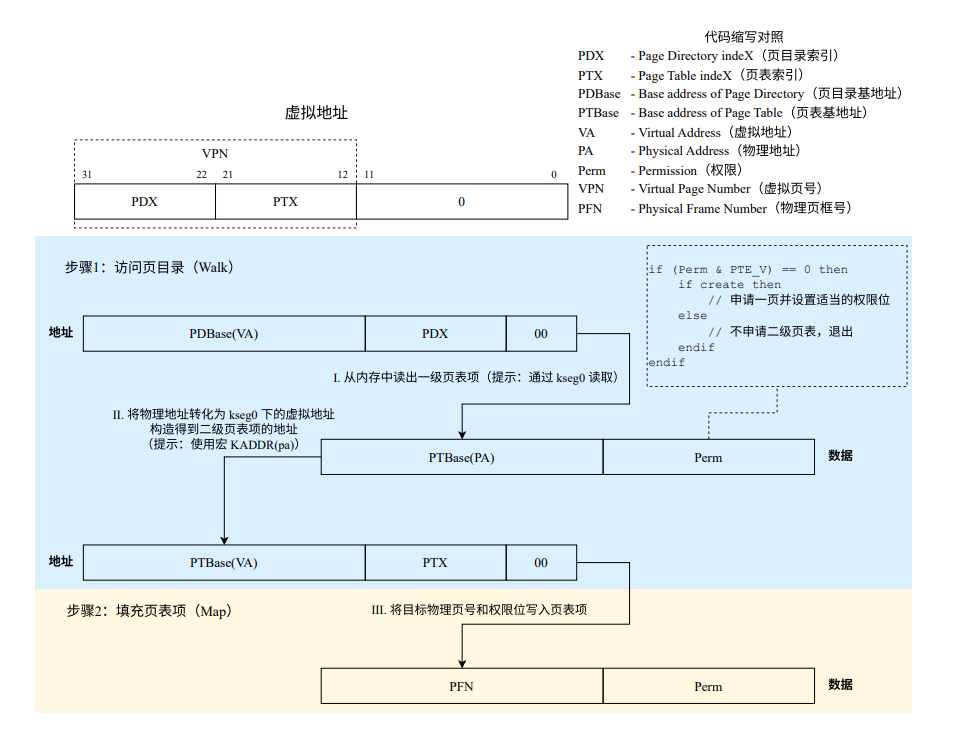

# OS-Lab2

## 思考题

### Thinking2.1

在编写的 C 程序中，指针变量中存储的地址被视为虚拟地址。
MIPS 汇编程序中 lw 和 sw 指令使用的地址被视为虚拟地址。

### Thinking2.2

宏实现链表的好处：

- 代码复用方便，一套宏支持所有数据类型。
- 编译时展开效率高，无函数调用开销。
- 简化操作，代码简洁。

性能对比：

- 单向链表：头插入删除快，尾部和中间插入删除慢。
- 循环列表，头尾操作快，中间删慢。
- 双向链表：任意位置插删都快，但占内存稍多。
- 整体来看，双向链表是权衡了时间复杂度与空间复杂度的设计。

### Thinking2.3

在项目中可以找到代码：

```c++
struct Page *le_next;
struct Page **le_prev;

struct Page_LIST_entry_t pp_link;
u_short pp_ref;

struct Page *lh_first;
```

第三个：le_prev是指向前一项le_next指针的指针。lh_first不是指针。

### Thinking2.4

ASID是每个进程独立虚拟地址空间的唯一标识符，要勇用于区分不同进程的地址空间。

ASID通常为8位，即有256中ASID，可以支持256哥不同的地址空间。

### Thinking2.5

由tlbex.c中可以看出调用关系：

```c++
void tlb_invalidate(u_int asid, u_long va) {
    tlb_out((va & ~GENMASK(PGSHIFT, 0)) | (asid & (NASID - 1)));
}
```

tlb_invalidate函数通过调用tlb_out函数，把va对应的页表项清空。

tlb_out:

```mips
LEAF(tlb_out)
.set noreorder # 禁止指令重排
    mfc0    t0, CP0_ENTRYHI # t0 = 保存原来的EntryHi
    mtc0    a0, CP0_ENTRYHI # 把传入的va(a0)写入EntryHi
    nop
    tlbp # 查找VA对应的TLB表项

    nop
    mfc0    t1, CP0_INDEX # t1 = 查找结果
.set reorder
    bltz    t1, NO_SUCH_ENTRY # 如果查找结果是负数（没找到），直接退出
.set noreorder
    mtc0    zero, CP0_ENTRYHI # 清空EntryHi，EntryLo0，EntryLo1
    mtc0    zero, CP0_ENTRYLO0
    mtc0    zero, CP0_ENTRYLO1
    nop
    tlbwi # 写入清空后的值

.set reorder

NO_SUCH_ENTRY:
    mtc0    t0, CP0_ENTRYHI # 恢复原来的EntryHi
    j       ra # 返回
END(tlb_out)
```

### Thinking2.6

- 函数调用需要开启进程，`env_init`需要`pgdir_alloc`为其分配页。
- `load_icode`在加载进程指令代码时，需要`page_alloc`和`page_insert`为加载二进制代码到内存而分配物理页并简历映射。
- 当进程结束或内存区域不再使用时使用`env_free`，需要`page_remove`从页表移出相关映射，`page_decref`减少物理页引用计数。

### Thinking2.7

- x86采用段页式两级管理，MIPS是纯分页式。
- x86的地址转换经过逻辑地址->段映射->线性地址->页映射->物理地址。MIPS是虚拟地址->页表映射->物理地址。
- x86段是地址映射核心，参与地址转换。MIPS段仅用于进程隔离，不参与地址转换。
- x86段权限+页权限双重控制，特权精细。MIPS仅页权限控制。

## 难点分析

代码量显著增大，有多个函数需要分析，且变量和宏十分繁多，阅读有些苦难。最重要的是搞清楚每个涉及函数的作用：

`mips_detect_memory`:返回可用物理页数

`alloc`:返回申请的物理空间

`mips_vm_init`:为两级页表分配物理空间

`page_init`:把物理空间划分为物理页

`page_alloc`:从page_free_list申请物理页

`page_free`:将物理页放回page_free_list

`pgdir_walk`:得到va对应的二级页表中的对应项索引

`page_insert`:简历pgdir_walk找到的项与物理页的映射

`page_lookup`:找到va对应的物理页

`page_decref`:降低物理页引用次数，讲到0时自动执行page_free

`page_remove`:降低va对应物理页的引用次数，并清空va对应的TLB表项

此外，搞清楚**多级页表**与自映射的逻辑也是分析代码的关键。



## 实验体会

Lab2的代码看似纷繁复杂，但实际上只要始终记住自己是在研究“内存管理”的事情，再辅以CO知识，便很容易形成初步的知识体系串联。

实验指导书Lab2部分的末尾有一副函数调用关系的示意图，这张图对整个Lab2以及也许对之后Lab3，Lab4的理解都十分关键（不过我十分好奇为什么不把这张图放到最前面......）

总之，反复阅读代码和指导书，直至做到能独立复述内存管理流程和主要涉及的函数，并且能看懂每个函数中每个语句的作用，基本对Lab2的理解就不会有太大问题了~至于extra，本次考察的是自映射的内容，这是理论课重点讲了实验却没怎么提过的内容，看来还是不能将实验和理论完全切割，下次上机有必要把理论知识也复习好了。